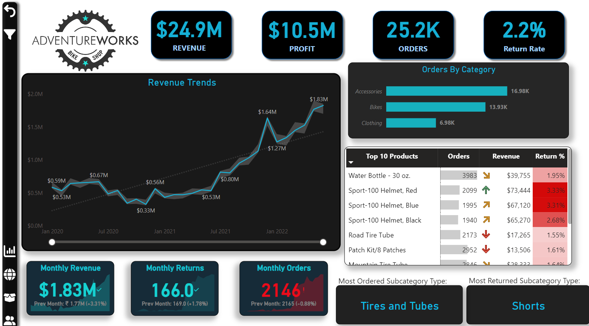
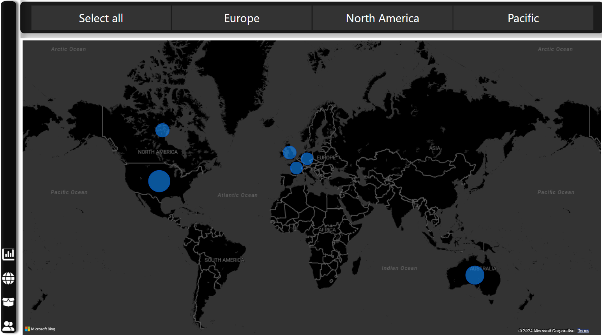
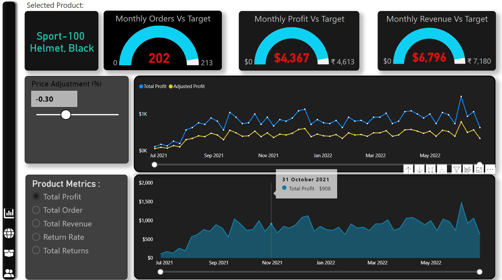
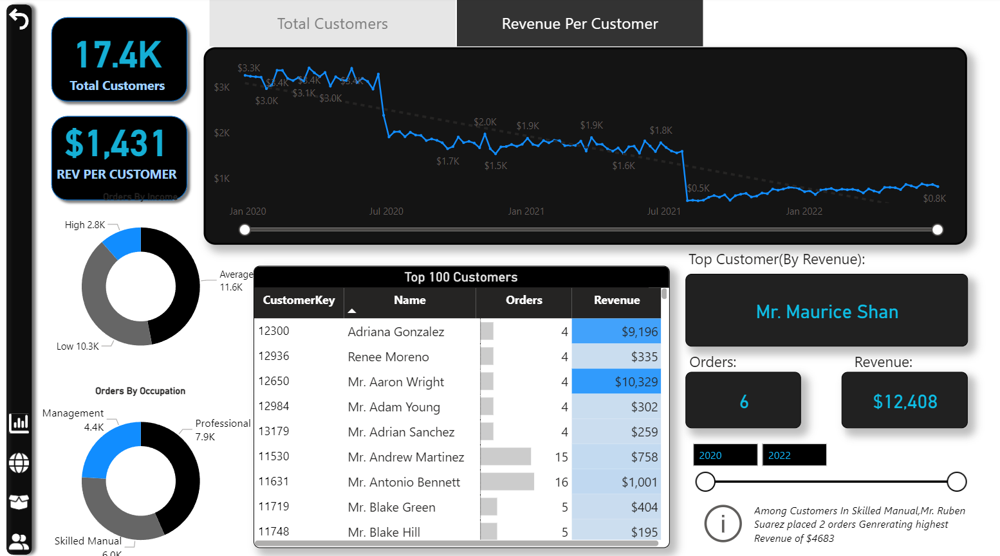

## Installation and Usage
1. Download and install [Power BI Desktop](https://powerbi.microsoft.com/desktop/).
2. Clone this repository or download the .pbix file.
3. Open the .pbix file in Power BI Desktop to explore the report.

## Dependencies
- Power BI Desktop

## Screenshots

